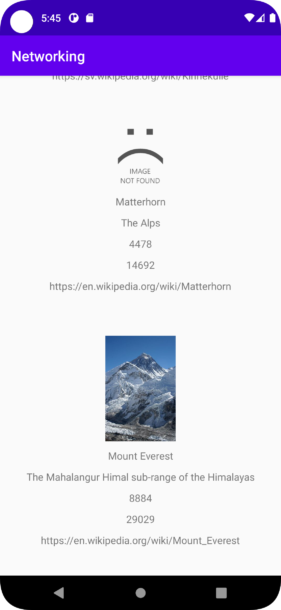

# Rapport

- Först tillades en recyclerview och en mountain activity vilka skulle komma att lista de olika bergen i en lista.
  Därmed kom även manifest filen att ändras för att ge möjlighet att koppla upp emot internettet.
- Sedan kommer MountainAdaptern att skapas, vilken har i uppgift att lista objecten i recyclerview, skapad tidigare i main activity.
  Vad adaptern gör är att framförallt använder sig av två funktioner onBindViewHolder och ViewHolder
  - Vad onBindViewHolder gör är att den tilldelar innehåll till views utifrån vilka delar i recyclerview:n som skall visas för tillfället.
  - ViewHolder visar sedan dessa värden genom att koppla dem till views i layout filen mountain_item.
  
``
public void onBindViewHolder(@NonNull final MountainAdapter.ViewHolder holder, @SuppressLint("RecyclerView") final int position) {
  holder.name.setText(mountains.get(position).getName());
  holder.location.setText(mountains.get(position).getLocation());
  holder.size.setText(mountains.get(position).getSize());
  holder.cost.setText(mountains.get(position).getCost());
  holder.wiki.setText(mountains.get(position).getAuxdata().getWiki());
}
.
.
.
public ViewHolder(@NonNull View itemView) {
  super(itemView);
  name = itemView.findViewById(R.id.name);
  location = itemView.findViewById(R.id.location);
  size = itemView.findViewById(R.id.size);
  cost = itemView.findViewById(R.id.cost);
  wiki = itemView.findViewById(R.id.wiki);
  img = itemView.findViewById(R.id.img);
  }
``
- Genom att analysera JSON filen kunde de olika attributen för mountain objecten skapas, (se kod nedan) vilket gjordes i en ny java fil kallad mountain.
  ``
  "ID": "mobilprog_k2",
  "name": "K2",
  "type": "brom",
  "company": "",
  "location": "The Karakoram range",
  "category": "",
  "size": 8611,
  "cost": 28251,
  "auxdata": {
  "wiki": "https://en.wikipedia.org/wiki/K2",
  "img": "https://en.wikipedia.org/wiki/K2#/media/File:K2_2006b.jpg"
  ``
  
- mountain_item fylls sedan med den layout de olika views recyclerview:n ska ha,(se bild) vilket består utav de attribut vi tidigare declarerat i objectet mountain.
- Gson parsing appliceras sedan i java filen main_activity (se kod nedan) 
  vilken laddar ned informationen ifrån ett Json script, och bryter sedan upp information genom att använda attributen i Mountain klassen.
``
@Override
public void onPostExecute(String json) {
    // Create GSON object to perform marshall/unmarshall operations
    Gson gson = new Gson();
    // Unmarshall JSON -> list of objects
    Type type = new TypeToken<ArrayList<Mountain>>() {}.getType();
    mountains = gson.fromJson(json, type);
    mountainAdapter.setMountains(mountains);
    mountainAdapter.notifyDataSetChanged();
``

- Sedan användes bibloteket picasso vilket tillåter en att visa bilder i sin application, 
  med det märkte jag även att vissa bilder inte kunde visas, efter att frågat på handledningen förstod jag att felet inte var på min sida.
  Där av skapade jag felhantering för att ladda in en error bild vilken talar om för användaren att bilden inte kunde hittas. (se kod nedan och bild) 
``
  // If an issue occurs when loading image display error, else do nothing
  Picasso.get()
  .load(mountains.get(position).getAuxdata().getImg())
  .into(holder.img, new Callback() {
    @Override
    public void onSuccess() {}
    @Override
    public void onError(Exception e) {
      Picasso.get().load("https://i.ibb.co/wC7Q8zm/Untitled.png").into(holder.img);
      }
  });
  ``
  

